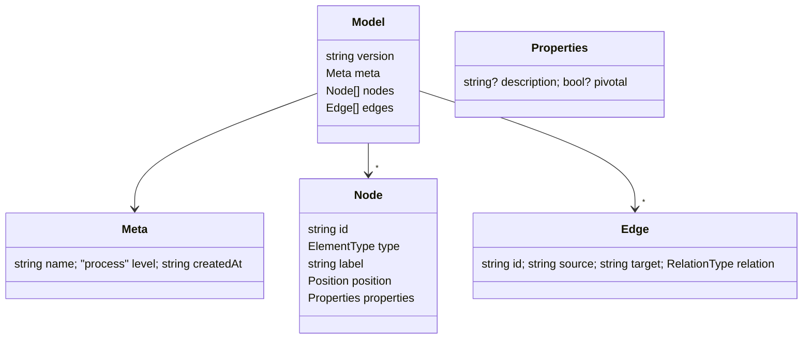
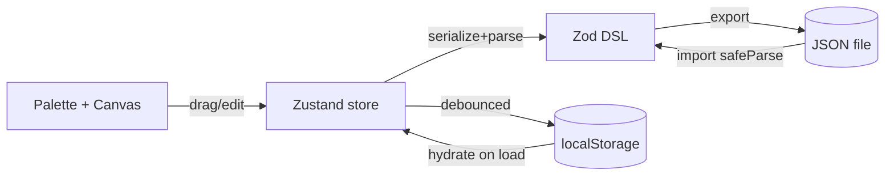

> **Superseded by [design-00002-structured-board](design-00002-structured-board.md)**
> per [decision-00002](../decision/decision-00002-structured-board-not-free-canvas.md).
> This free-canvas design produced an unreadable board; the editor was rebuilt as
> a deterministic structured board. Kept for history.

# Design: editor model and architecture

Technical design for [spec-00001-mvp-editor](../spec/spec-00001-mvp-editor.md),
linked by [plan-00001-mvp-editor](../plan/plan-00001-mvp-editor.md). Terms follow
[CONTEXT.md](../../CONTEXT.md).

## 1. Model = nodes + edges (uniform)

Everything on the canvas is a **node** or an **edge**, matching React Flow and
serialising 1:1 to the DSL. Two deliberate refinements vs the idea draft:

- **Hotspot is a node type**, and its attachment is an `annotates` **edge** — no
  separate `hotspots` array.
- **Pivotal is a boolean flag** on a Domain Event, not a separate element type.

Element types (node `type`): `domainEvent`, `command`, `actor`, `aggregate`,
`policy`, `readModel`, `externalSystem`, `hotspot`.

Relation types (edge `relation`): `issues`, `handledBy`, `emits`, `triggers`,
`invokes`, `informs`, `annotates`.

## 2. Connection rules (source → relation → target)

The only valid connections; anything else is rejected by `isValidConnection`.

| relation | source | target |
|---|---|---|
| issues | actor, externalSystem | command |
| handledBy | command | aggregate, externalSystem |
| emits | aggregate, externalSystem | domainEvent |
| triggers | domainEvent | policy |
| invokes | policy | command |
| informs | readModel | actor |
| annotates | hotspot | any element |

Encoded as a data table in `web/lib/eventstorming/` so both the UI validator and
unit tests read the same source.

## 3. DSL shape (Zod is the single source of truth)

The Zod schema produces the TS types used by the store and validates both export
(`parse`) and import (`safeParse`). `version` carries a migration hook for future
schema changes.

## 4. Data flow

All state lives in the browser; nothing is sent over the network.

## 5. Layout inside web/

- `web/lib/dsl/` — Zod schema, export/import.
- `web/lib/eventstorming/` — element and relation definitions, colors, icons,
  connection-rule table.
- `web/lib/store/` — Zustand store (nodes, edges, selection + actions).
- `web/components/` — canvas, custom nodes, palette, property panel.
- `web/app/page.tsx` — client editor shell (React Flow is client-only; render
  with `"use client"` / dynamic import `ssr:false`).
