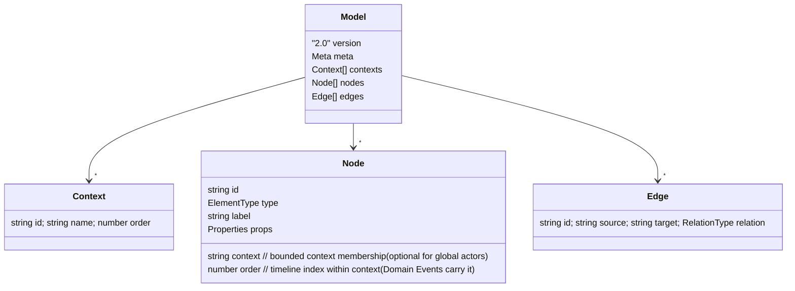

# Design: structured Event Storming board

Technical design for the rebuilt editor per
[decision-00002](../decision/decision-00002-structured-board-not-free-canvas.md).
Supersedes [design-00001](design-00001-editor-model-and-architecture.md).
Terms follow [CONTEXT.md](../../CONTEXT.md).

## 1. Principle

The user edits the **model**; the tool **computes the layout**. Position is never
chosen by the user. This is what keeps a board readable at any size.

## 2. Bands and columns

- **Row-band = element type**, fixed top→bottom:
  `actorSystem(0) · command(1) · aggregate(2) · domainEvent(3) · policy(4) · readModel(5) · hotspot(6)`.
  Actors and External Systems share the top band.
- **Column = timeline**, grouped by **bounded context**. Domain Events are the
  spine and carry the timeline order.

## 3. Domain model (DSL v2)



Changes vs v1: add `contexts` + `node.context` + `node.order`; **remove
`position`** (derived); bump `version` to `"2.0"`. The Zod schema stays the
single source of truth; a v1→v2 migration accepts old files (drops positions,
assigns a default single context and a derived order).

### Relations (connection-rule table v2)

| relation | source | target |
|---|---|---|
| issues | actor | command |
| handledBy (actsOn) | command | aggregate, externalSystem |
| emits (produces) | aggregate, externalSystem | domainEvent |
| triggers | domainEvent | policy |
| invokes | policy | command |
| **updates** *(new)* | domainEvent | readModel |
| informs | readModel | actor |
| annotates | hotspot | any |

New vs design-00001: **`updates`** (Domain Event → Read Model), completing the
grammar `event → updates → readModel → informs → actor`.

## 4. Layout engine (deterministic)

```
bandIndex(type) -> fixed row; y = bandIndex * BAND_H
column:
  1. order the contexts by Context.order -> context x-offset
  2. within a context, assign each Domain Event a local column by node.order
  3. propagate that column to the event's slice (the command that produced it,
     its aggregate, the policy it triggers, the read model it updates) via edges
  4. an actor/system takes the column of the command it issues / event it feeds
  5. hotspots take the column of the element they annotate
x = contextOffset(context) + localColumn * COL_W
```

Rendered by React Flow with `nodesDraggable={false}` and computed `position` per
node; edges auto-routed. React Flow keeps pan/zoom/minimap/fitView. A pure recompute
runs on every model change.

## 5. Interaction — slice builder

- The **Domain Event timeline** is the primary surface. Add an event → it takes
  the next timeline slot in its context.
- Contextual actions on a selected event/command build the slice: **+ Command**,
  **+ Actor**, **+ Aggregate**, **+ Policy**, **+ Read Model**, **+ Hotspot** —
  each creates the node with the right relation and lands in its band.
- The only "moves": **reorder the timeline** (drag events/columns to change
  `order`) and **reassign a node's context**. No free positioning.
- Cross-context / ambiguous links (e.g. which policy invokes which command) may
  be drawn manually; the drawn link is still validated by the rule table.
- Property panel edits label/description/pivotal/hotspot-text (unchanged).

## 6. Layout inside web/

Reuse `lib/dsl/` (schema v2 + serialize + migration), `lib/eventstorming/`
(add `updates`, band order), `lib/store/` (add contexts/order, drop position),
`components/` (custom nodes reused; replace palette drag-create with the slice
builder; add band rail + context headers). New: `lib/layout/` (the banded
layout engine).

## 7. Migration from plan-00001

Keep DSL/store/serialize/React-Flow/custom-node code; add the layout engine,
context+order model, `updates` relation, and slice-builder UI; disable free
drag. Tracked in plan-00002.

## 8. Levels (view filter)

`meta.level` is a Zod enum: `big-picture` | `process` | `design`. A level is a
**view filter over the same model** — switching it shows/hides element types
(and their bands and slice actions); it never deletes anything.

| Level | Element types shown |
|---|---|
| Big Picture | Actor, External System, Domain Event, Hot Spot |
| Process | + Command, Policy, Read Model |
| Design | + Aggregate |

Types are cumulative (Big Picture ⊂ Process ⊂ Design). The store holds the
current `level`; the board filters visible nodes/edges/bands, the toolbar
switches it, and it is serialized (`meta.level`) and autosaved. See §11 for
each level's purpose.

## 9. Concurrency — parallel events

The timeline stays strictly left→right; concurrency is expressed two ways:

- **Fan-out**: one Domain Event triggers several Policies (or an Aggregate emits
  several events) — multiple edges from one source. Already supported by the
  graph model.
- **Same-slot parallel events**: Domain Events that share the same `order` in a
  context are concurrent — they occupy one timeline column and stack in
  **sub-lanes**; each event's slice inherits its lane so parallel branches align
  top-to-bottom. (Swimlanes-by-actor are a different vertical partition that
  conflicts with type-bands; deferred as a possible Big-Picture-only layout.)

## 10. Connector routing

Nodes expose anchor handles on all four sides. Each edge picks the handle pair
from the two nodes' relative positions: the **vertical slice chain connects
bottom↔top**, while **timeline / cross-column relations connect left↔right** —
avoiding the awkward S-curves of a single left/right handle. Routing is derived
at render time from positions, so it re-computes with the layout.

## 11. Context columns & editing

Every context reserves an ordered column slot from the layout engine — including
empty contexts, so their headers never pile at the origin. Context headers are
editable (rename) and removable (removing a context drops its member nodes and
their edges). This is the only place `Context.order` and membership change; the
layout recomputes from them.

## 12. Actor vs External System

Both live in the top participant band (per the ddd-crew convention) but are
visually distinct: Actor is the small yellow sticky (person icon); External
System is a **wider pink** sticky (server icon). External Systems are created
through slice actions (a Command's "+ External System", an External System's
"+ Domain Event").
